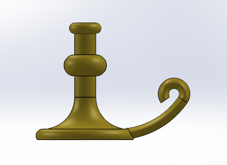
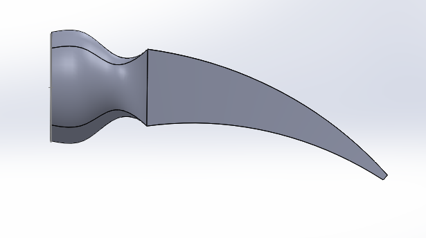
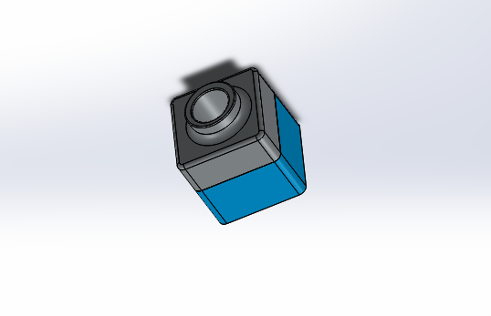
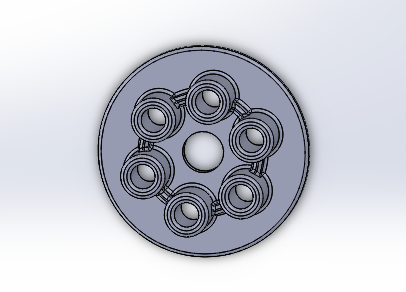

# Not_So_Basic_CAD

In Not So Basic CAD, we had two assignments. One was "Sweeps and Lofts" and the other was called "A Little Practice". For both, we went to SolidWorks and used the tutorials to build these four things. In Sweeps and Lofts we were told to build a candle stick and a hammer head. The hammer was a bit harder for me to figure out than the candle stick and took a little longer. 

